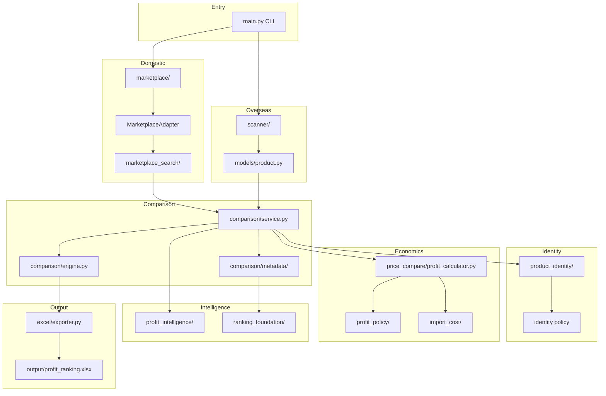
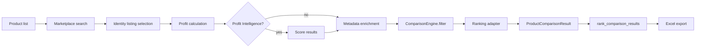
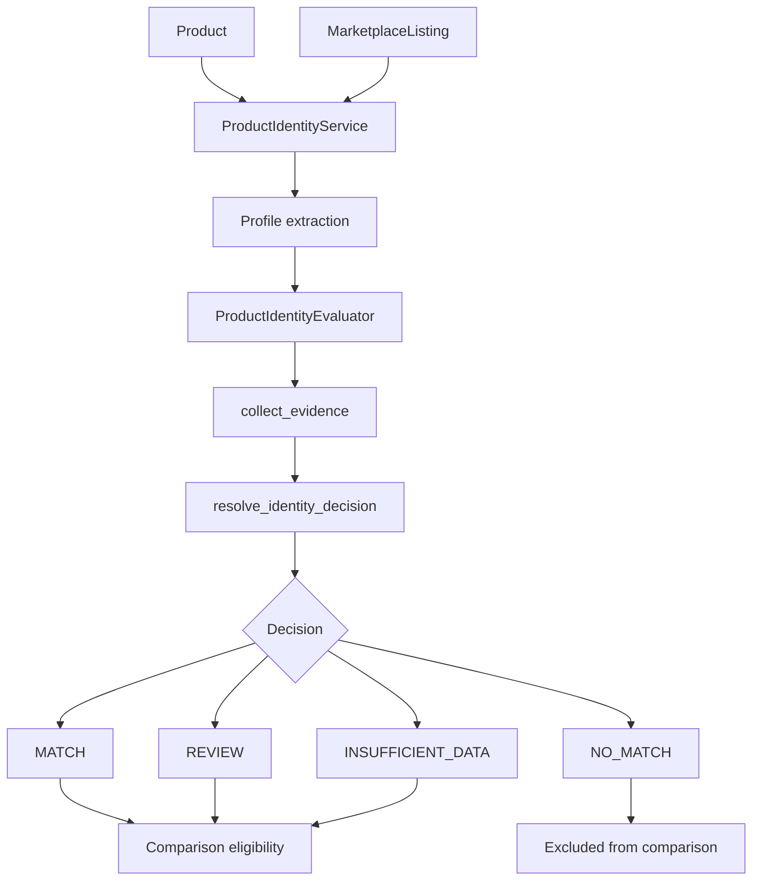
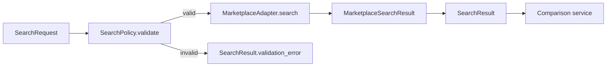
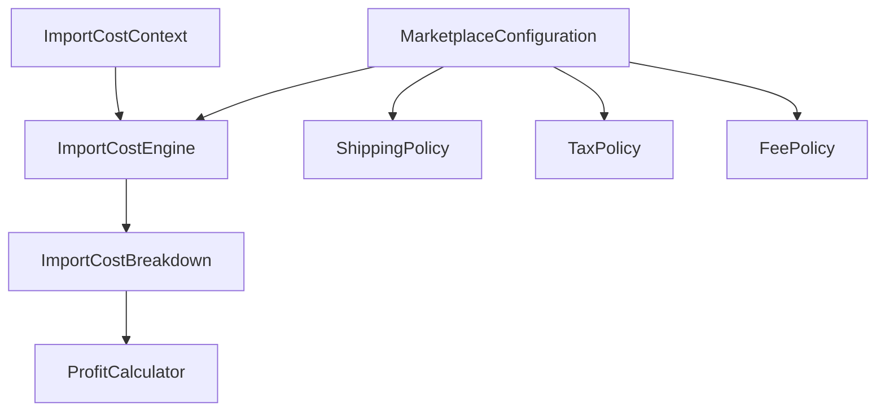
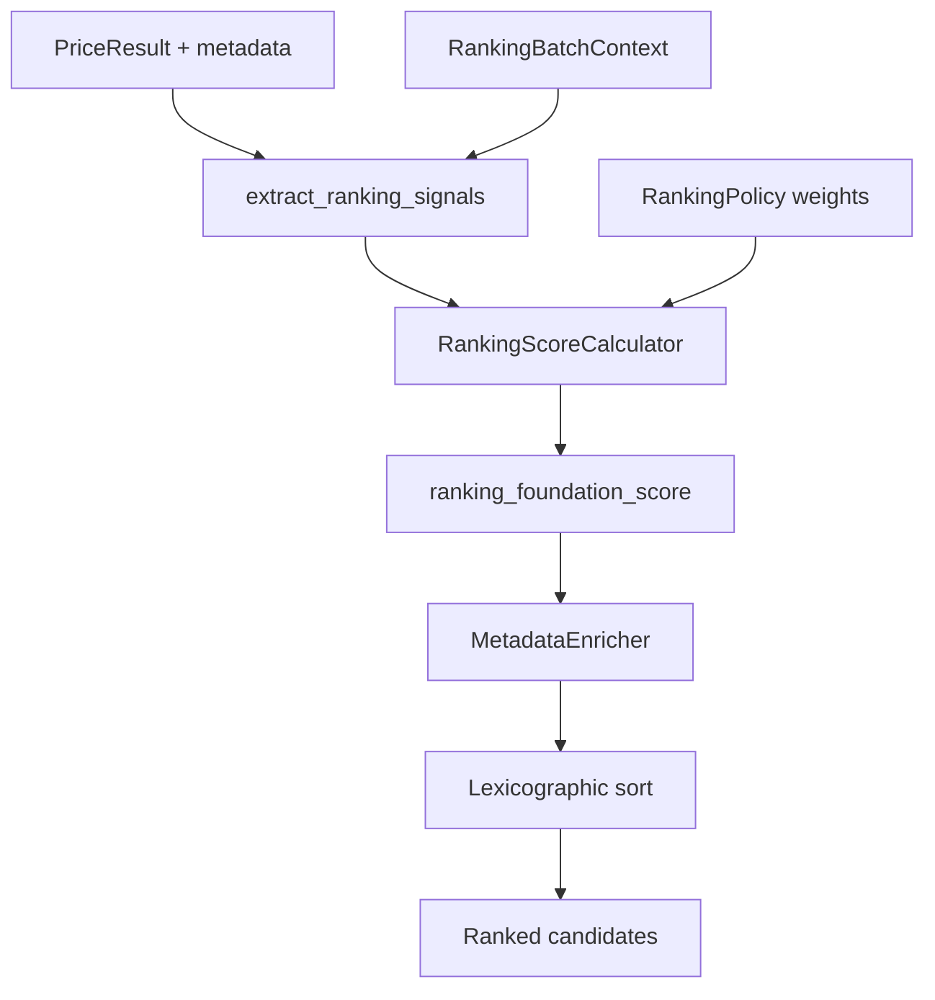

# BrandProfitFinder — Architecture

Version 1.0 Release Candidate architecture reference.

BrandProfitFinder compares overseas purchase prices with Japanese domestic marketplace sale prices, calculates import-side costs and profit, ranks opportunities, and exports Excel workbooks. All Version 1 pipelines are **deterministic**, **fixture-friendly**, and **non-mutating** on input models.

---

## Overall Architecture



---

## Package Responsibilities

| Package | Responsibility |
|---------|----------------|
| `config/` | Settings, constants, logging — no business logic |
| `models/` | Domain dataclasses (`Product`, `MarketplaceListing`, `PriceResult`, …) |
| `scanner/` | Overseas retailer HTML/JSON parsing → `Product` |
| `marketplace/` | Domestic marketplace search, validation, parsing |
| `marketplace/adapter.py` | Standard adapter contract for identity-safe integrations |
| `marketplace_search/` | Canonical search request/result, policy, routing service |
| `product_identity/` | Deterministic identity evaluation (not authenticity) |
| `profit_policy/` | Fee, shipping, tax, currency policies per marketplace |
| `import_cost/` | Import-side cost breakdown engine |
| `price_compare/` | Profit calculation, ranking engine, marketplace profit service |
| `profit_intelligence/` | Optional rule-based advisory scoring |
| `ranking_foundation/` | Extensible weighted ranking signals and scorer |
| `comparison/` | Cross-marketplace comparison orchestration |
| `excel/` | Workbook templates, formatting, export |
| `tests/` | Unit and integration tests with local fixtures |
| `scripts/` | Fixture generators and validation helpers |

---

## Comparison Pipeline

End-to-end flow for cross-marketplace comparison (Phase 18–25):



### Pipeline stages

1. **Search** — `CrossMarketplaceComparisonService` searches each marketplace. `MarketplaceAdapter` instances route through `MarketplaceSearchService`; legacy `BaseMarketplace` implementations call `search()` directly.
2. **Identity selection** — `_select_identity_listing()` picks the highest-scoring listing that passes identity policy.
3. **Profit** — `ProfitCalculator` uses `ImportCostEngine` and `profit_policy` configurations.
4. **Intelligence** (optional) — `ProfitIntelligenceService` adds advisory scores without changing profit values.
5. **Metadata enrichment** — `MetadataEnricher` populates ranking metadata (`ranking_foundation_score`, identity export fields, import cost totals).
6. **Comparison** — `ComparisonEngine` filters candidates, ranks via `ComparisonRankingAdapter`, builds `ProductComparisonResult`.
7. **Export ranking** — `rank_comparison_results()` selects best comparable candidate per product for workbook rows.

Enrichment is skipped when `ranking_foundation_score` is already present in candidate metadata.

---

## Identity Flow

Product identity determines whether a domestic listing plausibly matches an overseas product. It does **not** determine authenticity.



### Decisions

| Decision | Meaning |
|----------|---------|
| `MATCH` | Strong evidence; may proceed when score ≥ threshold |
| `REVIEW` | Ambiguous or unconfirmed brand; never authoritative match |
| `NO_MATCH` | Hard structured conflict |
| `INSUFFICIENT_DATA` | Not enough identifiers; visible but not authoritative |

### Key modules

- `product_identity/extractor.py` — builds `ProductIdentityProfile` from product/listing
- `product_identity/evidence.py` — field-level agreement/conflict evidence
- `product_identity/policy.py` — centralized `resolve_identity_decision()`
- `comparison/matcher.py` — `ComparisonIdentityMatcher` bridge for comparison pipeline

---

## Marketplace Adapter & Search Framework



`MarketplaceAdapter` extends `BaseMarketplace` with:

- `adapter_id`, `adapter_version`
- `uses_fixture_data`, `supports_structured_identifiers`
- `capability` → `MarketplaceCapability` metadata
- `adapter_metadata()` for diagnostics

Version 1 adapters: **StockX**, **GOAT**. Other marketplaces remain on `BaseMarketplace` until migrated.

---

## Import Cost Flow



`ImportCostContext` holds purchase price, currency, exchange rate, domestic sale JPY, and optional ancillary fees.

`ImportCostEngine.calculate()` returns an immutable `ImportCostBreakdown` with purchase, shipping, duty, tax, marketplace fee, and total cost components. JPY rounding uses `profit_policy/money.round_jpy()`.

When optional costs are omitted, numeric results match the pre–Phase 23 legacy calculator.

---

## Ranking Flow

Two ranking layers coexist by design:

### 1. Price-compare ranking (`price_compare/ranking_engine.py`)

Ranks a flat list of `PriceResult` objects for single-marketplace export. Delegates scoring to `ranking_foundation`.

### 2. Comparison ranking (`comparison/ranking_adapter.py`)

Ranks `MarketplaceCandidate` objects within a product comparison group.



Comparison sort order (backward compatible):

1. `ranking_intelligence_overall` (when profit intelligence enabled)
2. Comparable profit JPY
3. Profit margin
4. `data_completeness`
5. Fewer `comparison_warning_count`
6. Stable `order_index`

---

## Workbook Export

`excel/exporter.py` generates `output/profit_ranking.xlsx` with sheets:

| Sheet | Content |
|-------|---------|
| Products | Overseas product catalog |
| Listings | Domestic marketplace listings |
| Profit Ranking | Ranked profit results |
| Marketplace Comparison | Cross-marketplace comparison (when enabled) |

Column definitions live in `excel/template.py`. Identity export fields are appended to the Marketplace Comparison sheet via `product_identity/formatter.py`.

Validate output:

```bash
python scripts/validate_workbook_phase24.py
```

---

## Dependency Direction

```
models  ←  all packages (no upward imports)
config  ←  all packages

product_identity  ←  comparison
profit_policy     ←  import_cost, price_compare
import_cost       ←  price_compare
ranking_foundation ← price_compare, comparison/metadata
marketplace_search ← marketplace/adapter, comparison/service
comparison        ←  main.py, excel
```

Avoid circular imports: `marketplace_search/service.py` uses `TYPE_CHECKING` for adapter types.

---

## Design Principles (Version 1)

- **Deterministic** — same inputs produce same outputs
- **Non-mutating** — pipelines copy/deepcopy; inputs are not modified
- **Fixture-first** — tests and demos use `tests/fixtures/`; no live scraping in CI
- **Unknown stays unknown** — missing shipping, fees, or currency conversion are not treated as zero
- **Advisory only** — identity, intelligence, and comparison outputs require human review

---

## Related Documentation

- [README.md](README.md) — overview and quick start
- [DeveloperGuide.md](DeveloperGuide.md) — local development workflow
- [ExtensionGuide.md](ExtensionGuide.md) — adding marketplaces and scanners
- [ReleaseChecklist.md](ReleaseChecklist.md) — RC release verification

Legacy phase notes remain in `docs/` for historical reference.
