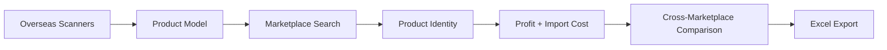

# BrandProfitFinder

Version **1.0 Release Candidate** — deterministic luxury brand profit analysis for overseas sourcing vs. Japanese domestic sales.

Compare overseas purchase prices with Japanese marketplace sale prices, calculate import-side costs and profit, evaluate product identity across listings, rank opportunities, and export Excel workbooks.

---

## Quick Start

```bash
python -m venv .venv
.venv\Scripts\activate          # Windows
# source .venv/bin/activate     # macOS/Linux

pip install -r requirements.txt
copy .env.example .env          # optional; defaults work for demos

python main.py                  # local pipeline → output/profit_ranking.xlsx
python -m pytest -q             # full test suite (1370+ tests)
```

### Key demos

| Command | Description |
|---------|-------------|
| `python main.py` | Default local marketplace pipeline |
| `python main.py --identity-demo` | Product identity evaluation (synthetic fixtures) |
| `python main.py --comparison-demo` | StockX + GOAT cross-marketplace comparison |
| `python main.py --comparison-demo --profit-intelligence` | Comparison with advisory scoring |
| `python main.py --demo-stockx` | StockX fixture demo |
| `python main.py --demo-goat` | GOAT fixture demo |

Validate workbook after comparison demo:

```bash
python scripts/validate_workbook_phase24.py
```

---

## Version 1 Capabilities

| Area | Package | Description |
|------|---------|-------------|
| Overseas sourcing | `scanner/` | Cettire, Baltini, Italist HTML/JSON parsers |
| Domestic marketplaces | `marketplace/` | Yahoo, Amazon JP, Rakuten, auctions, resellers, StockX, GOAT, … |
| Product identity | `product_identity/` | Deterministic MATCH/REVIEW/NO_MATCH (not authenticity) |
| Marketplace adapter | `marketplace/adapter.py` | Standard contract for identity-safe integrations |
| Search framework | `marketplace_search/` | Canonical SearchRequest/SearchResult routing |
| Profit policies | `profit_policy/` | Fee, shipping, tax, currency per marketplace |
| Import costs | `import_cost/` | Purchase, duty, tax, ancillary cost breakdown |
| Profit calculation | `price_compare/` | ProfitCalculator, ranking, marketplace profit service |
| Profit intelligence | `profit_intelligence/` | Optional rule-based advisory scoring |
| Ranking foundation | `ranking_foundation/` | Weighted ranking signals |
| Comparison | `comparison/` | Cross-marketplace pipeline and Excel export |
| Workbook | `excel/` | Multi-sheet Excel export |

Default execution uses **local fixtures only** — no live scraping or marketplace access.

---

## Architecture Overview



Detailed diagrams and pipeline stages: **[Architecture.md](Architecture.md)**

---

## Documentation

| Document | Purpose |
|----------|---------|
| [Architecture.md](Architecture.md) | System design, Mermaid diagrams, package responsibilities |
| [DeveloperGuide.md](DeveloperGuide.md) | Setup, testing, public APIs, conventions |
| [ExtensionGuide.md](ExtensionGuide.md) | Adding scanners, marketplaces, and hooks |
| [ReleaseChecklist.md](ReleaseChecklist.md) | RC1 verification checklist |
| `docs/` | Legacy phase specifications and coding standards |

---

## Repository Layout

```
config/          settings, constants, logging
models/          Product, MarketplaceListing, PriceResult, …
scanner/         overseas store parsers
marketplace/     domestic marketplace integrations
marketplace_search/   search request/result framework
product_identity/     identity evaluation
profit_policy/        fee, shipping, tax policies
import_cost/          import cost engine
price_compare/        profit calculator and ranking
profit_intelligence/  advisory scoring
ranking_foundation/   weighted ranking
comparison/           cross-marketplace comparison
excel/                workbook export
tests/                pytest suite and fixtures
main.py               CLI entry point
```

Full layout: **[DeveloperGuide.md](DeveloperGuide.md)**

---

## Testing

```bash
# Full suite
python -m pytest -q

# Phase 20–25 regression
python -m pytest tests/test_product_identity_phase20.py \
                 tests/test_profit_policy_phase21.py \
                 tests/test_marketplace_search_phase22.py \
                 tests/test_import_cost_phase23.py \
                 tests/test_ranking_foundation_phase24.py \
                 tests/test_comparison_unification_phase25.py -q
```

Tests use fixtures under `tests/fixtures/`. No network access in CI or default runs.

---

## Tech Stack

- Python 3.11+ (developed on 3.14)
- pytest, openpyxl, pandas, pydantic, httpx, BeautifulSoup
- See `requirements.txt` for pinned minimum versions

---

## Domestic Marketplaces

BrandProfitFinder compares overseas purchase prices with Japanese **sales** marketplaces.

| Marketplace | Role | Default mode |
|-------------|------|--------------|
| Local fixture | Development default | Always available |
| Yahoo Shopping | Domestic sales comparison | Optional live API |
| Amazon.co.jp | Domestic sales comparison | Fixture demo |
| Rakuten Ichiba | Domestic sales comparison | Fixture demo |
| Yahoo! Auction | Domestic sales comparison | Fixture demo |
| StockX / GOAT | Resale comparison | Fixture demo |
| Vestiaire, Fashionphile, TRR, Grailed, Chrono24, Farfetch | Used/luxury resale | Fixture demo |

Overseas **sourcing** stores: Cettire, Baltini, Italist.

Enable live or demo modes via `.env` (see `.env.example`) or CLI flags. See **[ExtensionGuide.md](ExtensionGuide.md)** for adding new marketplaces.

---

## Design Principles

- **Deterministic** — identical inputs produce identical outputs
- **Non-mutating** — pipelines do not modify input models
- **Unknown stays unknown** — missing fees, shipping, or FX are not treated as zero
- **Advisory only** — identity, intelligence, and comparison require human review
- **Not authenticity determination** — identity decisions describe evidence strength, not genuineness

---

## Status

**Version 1.0 RC** — feature complete for:

- Overseas scanning foundation (Cettire, Baltini, Italist)
- Domestic marketplace integrations (fixture-first)
- Profit calculation with policy and import cost engines
- Product identity foundation (Phase 19–20)
- Cross-marketplace comparison with ranking unification (Phase 18–25)
- Excel workbook export with comparison and identity columns
- 1370+ automated tests

Legacy phase-by-phase notes: `docs/03_TASK.md`, `docs/06_ROADMAP.md`

---

## License

See repository license file (if present).
